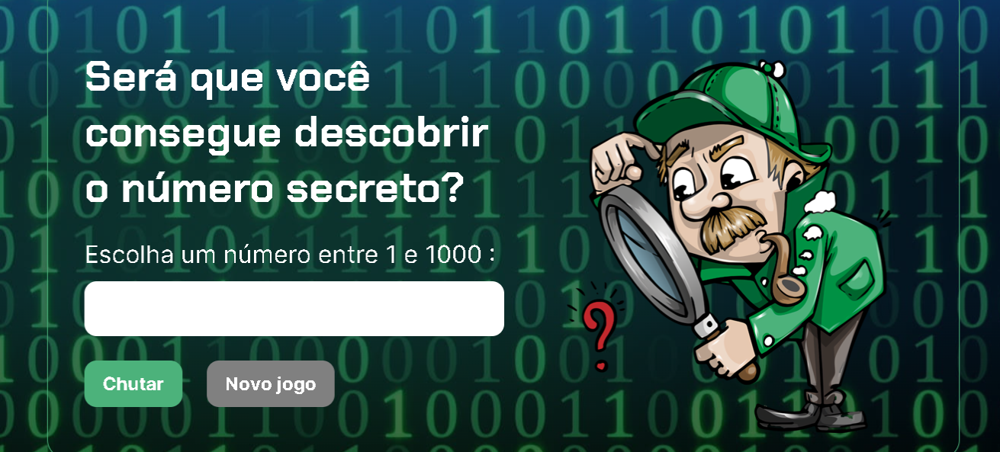

# Jogo do Número Secreto

Bem-vindo ao Jogo do Número Secreto! Este é um jogo simples desenvolvido em HTML, CSS e JavaScript, onde você tenta adivinhar um número secreto entre 1 e 1000.

## Como Jogar

1. Abra o arquivo `index.html` em seu navegador.
2. Escolha um número entre 1 e 1000.
3. Clique no botão "Chutar" para verificar se você acertou o número secreto.
4. Você receberá uma mensagem indicando se o número secreto é maior ou menor do que o número que você escolheu.
5. Continue tentando até acertar o número secreto.
6. Quando você acertar, o jogo parabenizará você e informará o número de tentativas.
7. Você pode iniciar um novo jogo clicando no botão "Novo jogo".

## Recursos e Funcionalidades

- Utiliza a biblioteca ResponsiveVoice para sintetizar fala.
- Gera um número secreto aleatório a cada jogo.
- Fornece feedback visual e auditivo para o jogador.
- Limita as tentativas do jogador até que ele acerte o número secreto.

## Arquivos do Projeto

- `index.html`: Contém a estrutura HTML do jogo.
- `style.css`: Arquivo CSS para estilizar a aparência do jogo.
- `app.js`: Arquivo JavaScript que controla a lógica do jogo.

## Como Contribuir

Se você deseja contribuir com melhorias ou correções para este jogo, sinta-se à vontade para fazer um fork deste repositório, implementar suas alterações e enviar uma solicitação de pull request.

Divirta-se jogando!
